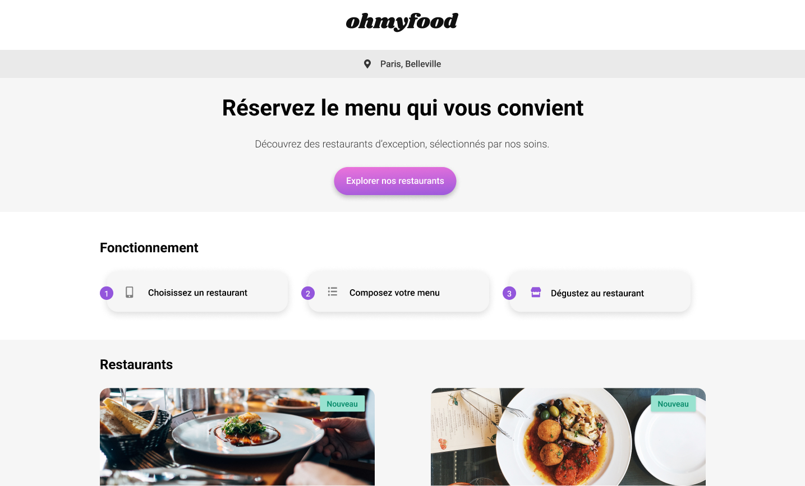
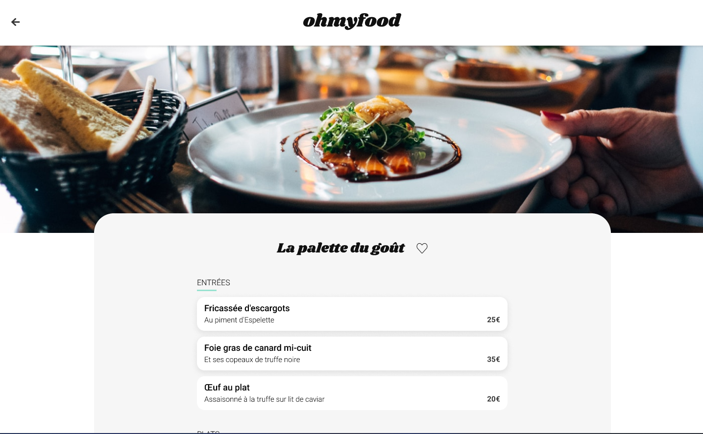

# Oh My Food





## Description

- "Oh My Food" is the 3rd student project from the OpenClassrooms "React Developer" path!
- Made with 💖 using HTML, CSS, & Sass.
- Wireframes & Mockups on Figma 👉 [here](<https://www.figma.com/file/t4449fzDnwGYmzuwQdu87V/Maquettes-Ohmyfood-(mobile-et-desktop)?type=design&node-id=25368-627&mode=design&t=ahWMOybV6JaIjvQG-0>).
- Download the code and discover the project on your local server by launching the "Live Server" extension in VS Code on "index.html".

```terminal
git clone https://github.com/beseb/Ohmyfood.git
```

Enjoy! 😊
